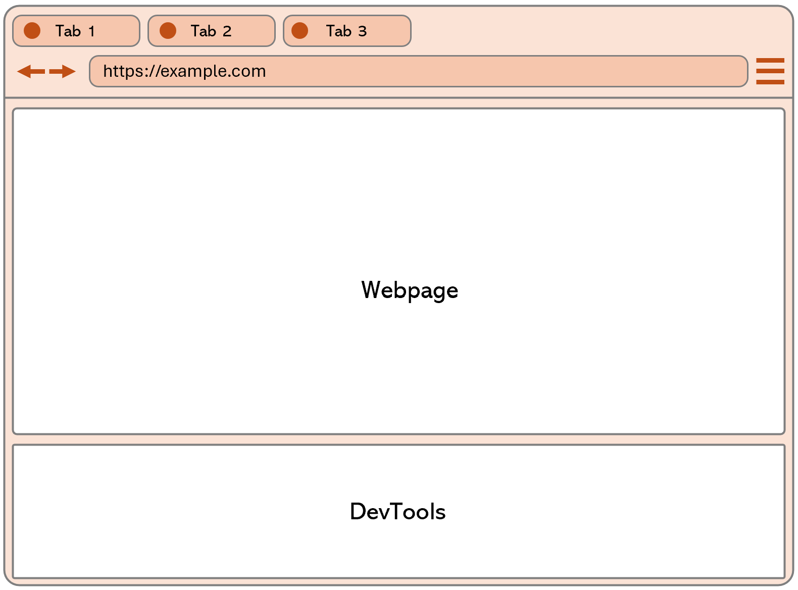
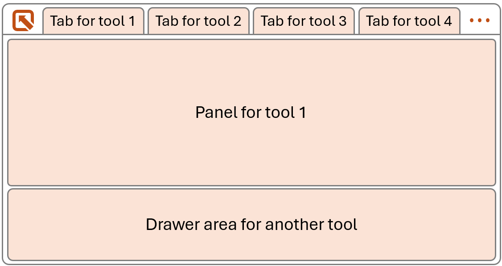
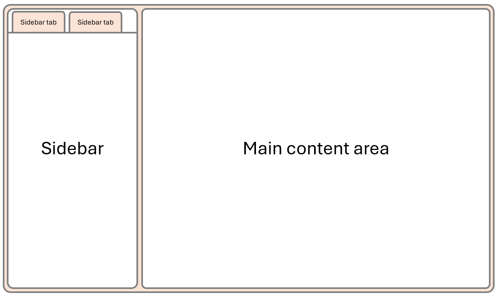
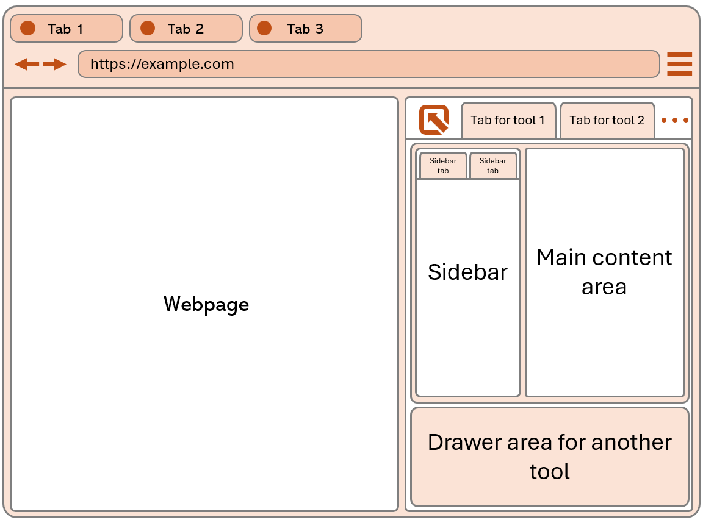

# Understand DevTools

This guide is an introduction to DevTools, which is a suite of web development tools that are built-in to most web browsers. Read this guide if you are starting web development and haven't used the built-in browser tools yet. You will learn what DevTools is, who it's for, how to open it, how its UI is organized, what tools exist, and what the main user workflows are.

## A word about security first

To some people, DevTools can look complex and sometimes scary. If you've opened DevTools by accident without knowing what it is or understanding web development, it may look like you've been hacked. **Don't worry, this is not the case, DevTools isn't giving privileged access to the website you're viewing, or to your computer, to a bad actor**. You can close the tab where DevTools appeared and continue browsing the web.

Be careful, however, with websites that ask you to open DevTools and, within it, paste code that they provide you. This might be an attempt to steal sensitive information from you. **Never paste code into DevTools unless you understand what the code does**.

## Terminology

DevTools is short for _Developer Tools_. 

## How to open DevTools

Before learning more about DevTools, let's open it so you can have it in front of you while reading this guide.

Right-click anywhere on this page and then select **Inspect** (or **Inspect element**, depending on your browser). DevTools opens up in a new browser panel either to the right or at the bottom of the current browser window. You can resize the DevTools panel to be larger or smaller.

If you're using Safari, the **Inspect** menu item isn't visible at first and you need to enabled it. <SEE ALSO TIP ABOUT ENABLING SAFARI WEB INSPECTOR TOOL>.

Keep reading to learn more about DevTools.

## What is DevTools

In this guide, we focus on the following web browsers: Firefox, Chrome, Edge, and Safari. However, other browsers such as Opera, Arc, or Brave have similar DevTools. We also focus on the desktop versions of these browsers only. Mobile browsers usually don't have built-in DevTools.

### DevTools is a built-in browser feature

DevTools is a feature that's built-in to web browsers. This feature is hidden by default and normal users don't see it. For example, you typically don't see DevTools when you're accessing your emails, or doing online shopping. DevTools is usually only useful when you're learning web development and developing your own website. DevTools is a key part of any web development workflow and can help you find and fix bugs on your website.

Because DevTools is built-in to your browser, you don't need to install it as a separate application. When you install Chrome, or Firefox, or any other browser, DevTools is installed at the same time. This also means that when your browser gets updated (which, for many browsers, happens once a month), DevTools gets updated too. You may therefore see differences the next time you open DevTools. Finally, this means that you can't un-install DevTools.

There are ways to disable DevTools. <SEE ALSO TIP ABOUT BLOCKING DEVTOOLS FROM MENU IN SAFARI (DEFAULT), FROM F12 IN EDGE (DEVTOOLS), AND FROM POLICIES (FIND LINKS TO VARIOUS BROWSERS)>.

### DevTools is always attached to a target

DevTools is always _attached_ to a single target, which often is a browser tab.

For example, if you open a new tab in your browser and open DevTools in that tab, then this instance of DevTools is _attached_ to the tab. DevTools can be used to debug the websites that are displayed in that tab only. If you navigate to different websites within the same tab, then the particular instance of DevTools you opened in the tab is still attached to that tab. If you open another tab and open DevTools in the new tab, you now have two instances of DevTools: one for each tab.

In this example, the target that DevTools debugs is a tab. DevTools is, however, capable of debugging other types of targets. For example, you can attach DevTools to a NodeJS process, or you can attach DevTools to a web view that's embedded in a native application. In this guide, we'll only focus on attaching to browser tab targets, but anything that uses a web engine to run can be debugged by DevTools.
        
<INSERT DIAGRAM SHOWING THE PER TARGET ATTACH>

### DevTools is not standard

The web runs on standard technologies. HTML, CSS, JavaScript, and SVG for example, are specified once and implemented the same way in all browsers.

This is not the case for DevTools. DevTools is not specified and looks and behaves differently in all browsers. For example, you'll see that the DevTools in Safari looks different and has different features than the DevTools in Edge. DevTools is a part of the browser UI. Just like different browsers have different tabs or address bars, they have different DevTools too.

While this can make it harder to jump between different browser DevTools to test and debug your website across browsers, you'll learn in this guide that there are high-level similarities that ease the pain.

## Who is DevTools for

The vast majority of the people who use DevTools are web developers, but others may find it useful too.

When you're writing the code for a website, chances are that bugs will happen. You might make a mistake in the HTML content, or in the CSS style of the page, or in the JavaScript logic. DevTools can help you investigate and fix those bugs. With DevTools, you can inspect the code that the browser is running to display your page, find what the problem is, and then correct it in your source code.

DevTools also allows you to make changes to the page that's being debugged. For example, if you made a CSS mistake in the color of an element, you can change the element's color to test a fix. Because of this ability to make changes to a page, DevTools might be appealing to non web developers too. For example, you could use DevTools to slightly tweak a web page and make it easier to read: you could remove various elements or change the text size and color.



Continue reading to learn more about how these changes are made, and what they affect.

## How DevTools works

### DevTools debugs the runtime version of your webpage

To understand how DevTools works, you first need to understand how browsers work a little bit. When you enter a URL to a webpage in your browser, the document that lives at that URL, and its dependencies, are fetched and parsed by the browser. The entire code that the webpage needs is run and the page is rendered into the browser tab.

If you're the author of this webpage, the HTML, CSS, and perhaps JavaScript code that you wrote in your text editor is what led to the page being rendered in the browser. But the code was parsed, interpreted, and run by the browser, which resulted in the page being displayed.

What runs in the browser for your page to show up is different than the code you wrote, it's an runtime version of it.

**The runtime version of your webpage is what DevTools debugs. DevTools doesn't debug your original source code.**

For example, when the browser fetches the HTML content of your web page, it parses it and generates a tree of [DOM](https://developer.mozilla.org/docs/Web/API/Document_Object_Model/Introduction) nodes from it. The DOM tree is what is then used to render the page visually in the browser. DevTools let's you see and interact with the DOM tree, not with the original HTML source code.

<INSERT DIAGRAM OF SOURCE CODE VS. RUNTIME AND WHAT DEVTOOLS SEES>

### DevTools can't change your source code

Because DevTools debugs the runtime version of your webpage, instead of the original source code, the changes you make in DevTools are not saved to your source code, and are not persisted when you reload the page.

1. DevTools can't change your source files in your text editor or on your web server.

   DevTools is only part of the web browser, and doesn't have access to the text editor that you used to write the code. It also doesn't have access to the web server that you're using to host your website. When you make a change with DevTools to some CSS color or margin, or to some text on the page, those changes are only made to the rendered web page that's running in the browser. The changes aren't made to your source code, nor to the files in your web server.

1. Changes made in DevTools are not persisted.

   Reloading the page in the browser after having made changes to it by using DevTools will result in losing the changes. Again, the changes are only made to the runtime version of the page. When you reload the page, the browser goes to the server again, gets the source code for the page, and displays it, clearing anything that was displayed in the same tab before.

## The UI of DevTools

DevTools is not standard, and it therefore looks and behaves differently depending on the browser you choose to use for your web development activity. However, there are high-level similarities between the DevTools of different browsers. In this section, we'll look at the main UI elements of DevTools and how they are organized. The goal of this section isn't to understand every tiny details of the UI, but rather to get a high-level understanding of the main pieces that compose the DevTools UI.

### Terminology

DevTools has a complex user interface, because it has a lot of different features. Because of this, there are many different terms that are used to describe its UI, like panel, section, drawer, tool, tab, and more. In this guide, we use the following terms consitently:

* Toolbar: the horizontal (sometimes vertical) bar at the top of DevTools that contains tabs.
* Tab: a single tab within the toolbar, which allows to switch between different tools.
* Panel: the main area that corresponds to a tab, where the content of a tool is displayed.
* Tool: a feature of DevTools, specialized in a particular web development task, which appears inside a panel.
* Sidebar: a vertical bar on the left or right side of a tool's content, within a panel.
* Drawer: a horizontal, toggleable, area, which appears at the bottom and optionally contains a second toolbar for accessing other tools.

### High-level UI description

DevTools appears next to the rendered webpage, in a browser tab. It might appear to the right of the webpage:

Or it might appear at the bottom of the webpage:

Now let's focus on just DevTools. The following screenshot shows DevTools only, without the rendered webpage next to it or the browser UI around them. The screenshot shows the toolbar at the top of DevTools, with tabs, one tab per tool. The bottom part contains a panel that displays the content of the currently selected tool:

It's also possible for two tools to be visible at once, with one in the panel, and one in a toggleable drawer at the bottom. Often, the tool displayed in the drawer is the **Console** tool, which is used to log messages and run JavaScript code.

Let's zoom in one more level and focus on the content of the tool that's displayed in the panel. The following screenshot ignores the toolbar and drawer, and only shows the content of the panel where a tool is displayed. Each tool is different, and they don't all look the same, but the following screenshot shows the main elements that are often present in a tool: a sidebar on the left, with tabs used to display different sections of the tool, and a main content area on the right, which displays the content of the currently selected section:

Now let's put it all back together in one screenshot, so you can see how everything fits together. The screenshot shows the entire browser window, with a rendered webpage on the left, and DevTools on the right. DevTools has a toolbar, with tabs, a panel showing the selected tool, and a drawer area at the bottom. The panel shows a tool which contains a sidebar, and a main content area:

This might look like a lot of UI elements, and hard to understand at first. But, hopefully, with the way we've broken it down step by step, it helps making sense of the UI and forming a mental model of how it's organized.

### Main differences between browsers

The UI of DevTools is something that each browser implements a little bit differently. The high-level UI description above is a generalization of the UI of DevTools across browsers. In this section, we'll look at the main differences between browsers.

It's a good idea to test your website across different browsers, to find bugs that may manifest on certain browsers only. When this happens, you'll need to use the DevTools of the browser where the bug happens. Therefore, even if this browser isn't the one you normally use, it's good to be familiar with its DevTools.

TODO: are there any other major differences between browsers?

## The tools

One of the aspects of DevTools that makes it complex is that it contains many different tools. The web development field is vast and there are many different tasks involved with it such as designing the look of a website, writing the code that makes it interactive, optimizing its performance, making sure it's accessible to everyone. DevTools contains tools that help with all of these tasks, and more. On top of this, DevTools accomodates for different types of users as well.

This complexity leads to a high number of tools and features, which translates into a complex UI. But there are two things to keep in mind:

* You don't need to use all the tools all of the time. You can focus on just a few tools that are relevant to the task you're working on.
* You shouldn't be afraid to explore the tools that you don't know yet. You might find that they become useful to you at certain times.

### The main tools

The tools below tend to be the most used ones. Each tool is listed with a short description of what it's useful for.

| Tool | Description | Use cases | Specific browser note |
| ---- | ----------- | -------- | --------------------- |
| **Elements** | Displays the DOM tree and applied CSS rules. | Find and fix HTML and CSS bugs by editing the DOM and CSS styles. | This tool is called **Inspector** in Firefox. |
| **Console** | JavaScript environment to print messages and evaluate code. | Log messages and debug JavaScript issues. | |
| **Network** | HTTP network traffic logger. | Improve load performance, debug broken requests, export requests, replay requests. | |
| **Sources** | JavaScript debugger. | Set breakpoints, step through code, inspect variables. | This tool is called **Debugger** in Firefox. |
| **Performance** | Performance profiler. | Improve load and runtime performance, find slow JavaScript functions or rendering issues. | |
| **Memory** | Memory profiler. | Find memory leaks and high memory consumption issues. | |
| **Application** | Displays local storage, service workers, web app manifests, and other resources. | Debug storage, web applications, and PWA issues. | In Firefox, the **Application** tool only focuses on service workers and web app manifest. Use the **Storage** tool to inspect and edit storage. |

### More tools

The previous list of tools is far from being exhaustive. They're the most used tools, because they correspond to the tasks that web developers most often need to do. But they also happen to be the tools that are usually opened by default in the DevTools main toolbar.

Don't be afraid to look around for more tools to use. The list below contains more tools that you might find useful.

| Tool | Description | Use cases | Specific browser note |
| ---- | ----------- | -------- | --------------------- |
| **Accessibility** | Displays accissibility metadata about the page. | Make sure your website is accessible to everyone by viewing the page the way assistive technology sees it. | This tool is a separate tab in the main toolbar only in Firefox. In Chrome and Edge, it's a sidebar tab inside the **Elements** tool. |
| **Animations** | Web/CSS animations recorder/replayer. | Debug web animations, CSS animations, and CSS transitions issues, such as timing, delay, or iteration. | In Firefox, this tool is a sidebar tab in the **Inspector** tool. The tool doesn't exist in Safari. |
| **Issues** | Browser-reported issues. | Find and fix performance, security, accessibility, and other browser-reporter issues. | This tool only exists in Edge and Chrome, and these two browsers don't log the same issues in it. Firefox displays issues in the **Console** tool. |
| **Changes** | Collects CSS changes made in DevTools | Bring back CSS modifications made within the **Elements** or **Inspector** tool to the page. | This tool is a separate tab in Chrome and Edge, and a sidebar tab in the **Inspector** tool in Firefox. |

There are many more tools available. <SEE ALSO TIP ABOUT THE LIST OF ALL TOOLS>.

Take time to explore the tools that you don't know yet. And refer to the documentation of each browser DevTools to find out more. <SEE ALSO TIP ABOUT WHERE TO FIND THE DOCS FOR EACH DEVTOOLS>.
        
### Where to find the tools

#### Firefox

In Firefox, most tools are displayed as tabs in the main toolbar, at the top of DevTools. Depending on the size of the DevTools window, not all tabs may be visible. Click the **>>** button at the right of the toolbar to see the hidden tabs.

Some tools may also be disabled from the DevTools settings. To view the entire list of tools and toggle them, press <kbd>F1</kbd> to open the **Settings** panel, and then choose the tools you want to see from the **Default Developer Tools** list.

#### Chrome

TODO

#### Edge

TODO

#### Safari

TODO

## The workflow

TODO: describe the most common dev loop (code, inspect/debug, make change, refresh). Then describe in more details some chosen few workflows like runtime analysis, debugging, inspection.
