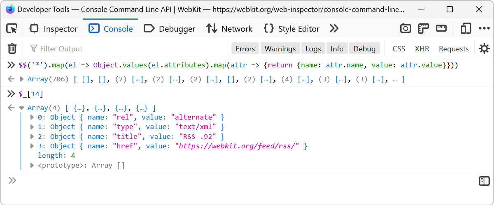
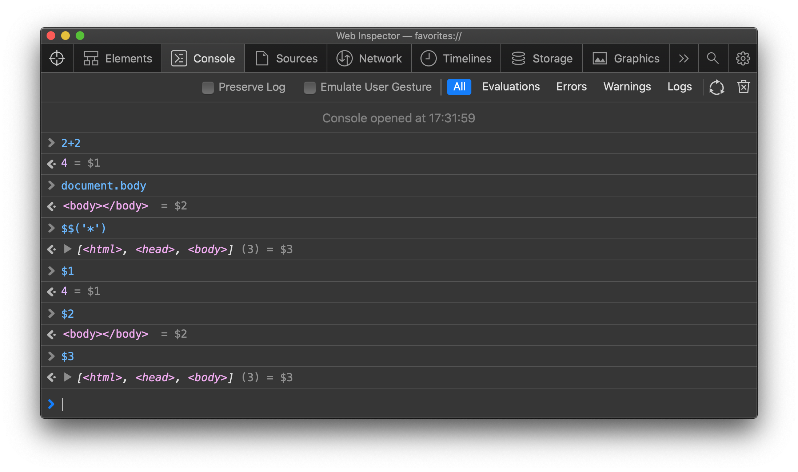

Imagine you evaluate a long expression like `$$('*').map(el => Object.values(el.attributes).map(attr => {return {name: attr.name, value: attr.value}}))` which extracts the attributes from all of the DOM elements on the page.

Now imagine you want to access one element in particular from the giant returned array. You could just type the same expression again and add `[14]` at the end of it to access the 15th item.

Or, you can use this great Console trick to reference the previous result without having to type it again:

To access the last result just type `$_` in the Console. In the above example, you would therefore type `$_[14]`.

**Safari goes even further** and provides shortcuts from `$1` all the way to `$99` to access previous results too. So if you had evaluated many expressions in the Console before, you can refer to their results by using one of the `$n` shortcuts where `$1` is the first evaluated expression, `$2` is the second one, and so on ([more information here](https://webkit.org/web-inspector/console-command-line-api/#$1)).

