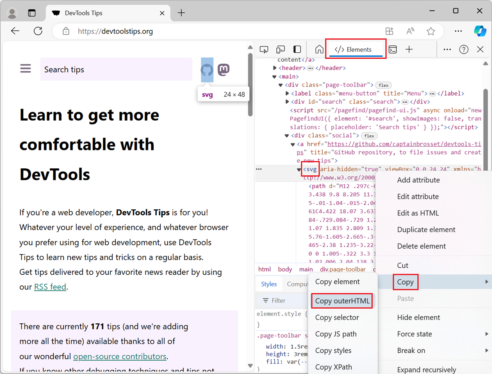

To copy the SVG source code of an SVG image that's embedded directly in the HTML of a webpage, use the **Elements** tool in DevTools (**Inspector** in Firefox).

1. To open DevTools, right-click the SVG image on the webpage, and then click **Inspect**.

   DevTools opens up, with the **Elements** (or **Inspector**) tool showing the HTML of the page.

1. Make sure the `<svg>` element is selected. Depending on where you right-clicked on the webpage, an element that's inside the `<svg>` element might be selected instead. If so, click the `<svg>` element to select it.

1. Right-click the `<svg>` element in the **Elements** (or **Inspector**) tool, and then click **Copy** > **Copy outerHTML** (or **Outer HTML** in Firefox).

   The SVG source code is now copied to your clipboard.

1. Paste the SVG source code wherever you want to use it.

