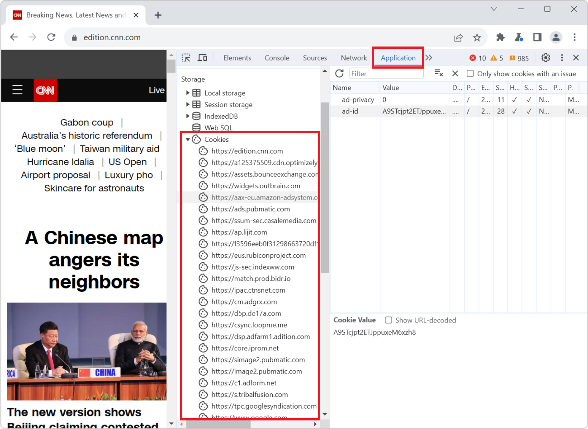

Cookies are small files that websites save on your computer when you visit them. Websites often use cookies to remember things about your last visit. For example, a weather website can use cookies to store your preferred location, so you don’t have to enter it every time. 

Third-party cookies are just cookies too, but they are created by websites other than the one you are visiting, for example when the website you are visiting embeds an advertisement iframe.

Third-party cookies are often used by advertisers to keep track of the websites a user visits, collect information about their browsing activity, with the hope of offering targeted ads and getting them to return to a website to buy products.

There are very legitimate uses for third-party cookies and personalized content, but they also pose significant privacy and security concerns.

With DevTools, you can detect if a website uses third-party cookies:

1. Go to the website you want to test in a new window or tab.
1. Open DevTools.
1. Open the **Application** tool in Chromium-based browsers, or the **Storage** tool in Firefox or Safari.
1. In the sidebar, expand the **Cookies** section.
   
A list appears in the **Cookies** section. Check the list to see if the website uses third-party cookies:

* If the website doesn't use cookies, the list will be empty.
* If the website uses its own (first-party) cookies, you will see one item which matches the website's URL.
* If the website uses third-party cookies, you will see more items in the list, some being from third-party websites that may just be tracking you.

