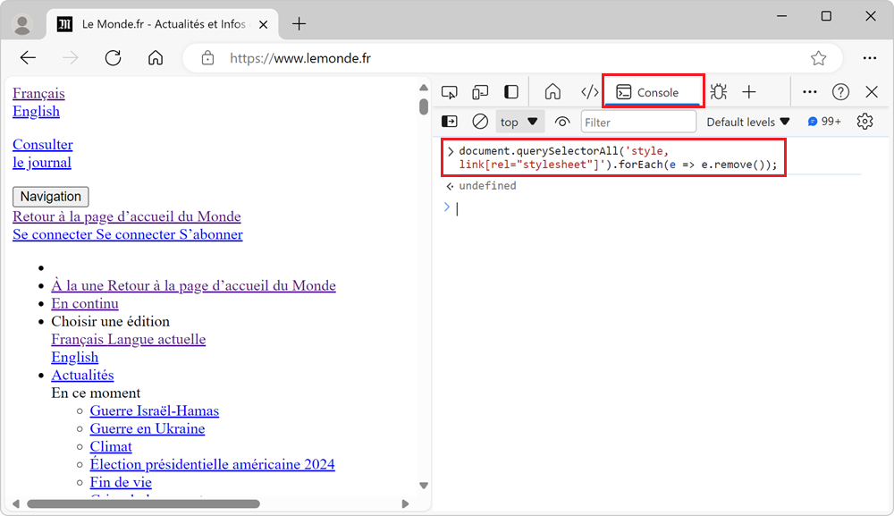

To remove all CSS styles on a webpage, for example to test the accessibility of a page when styles are disabled, or to verify the order in which content is displayed, you can use the techniques below. Don't worry, the styles will be re-enabled when you refresh the page.

### By running JavaScript in the console

1. Open the **Console** tool in your browser DevTools.

1. Enter the following JavaScript expression:

   ```javascript
   document.querySelectorAll('style, link[rel="stylesheet"]').forEach(e => e.remove());
   ```

   The expression above finds all `<style>` elements and `<link rel="stylesheet">` elements on the page, and removes them.

1. Press <kbd>Enter</kbd> to run the expression. The page is now displayed without any CSS styles:

   

### By using Firefox's Style Editor tool

Firefox has a tool named **Style Editor**, which lists all the stylesheets used on the page. To disable the styles on the page:

1. Open the **Style Editor** tool in Firefox DevTools.
1. Click the **Toggle style sheet visibility** buttons (the eye icons) next to each stylesheet to disable it.

### By using the Sources tool in other browsers

1. Open the **Sources** tool in Chrome or Edge DevTools.

1. Find the CSS files that you want to disable, for example by pressing <kbd>Ctrl+P</kbd> (or <kbd>Command+P</kbd> on macOS) to open the **Command Menu** and by typing **.css** to filter the CSS files.

1. Select the entire text in the CSS file and delete it.

1. Repeat with the other CSS files you want to disable.
