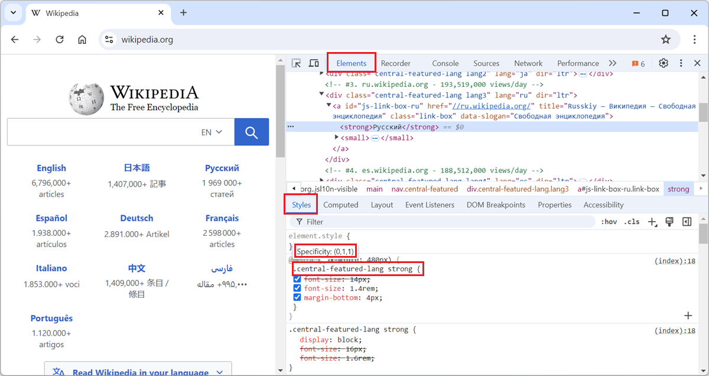

The specificity of a CSS selector is a score that the browser computes based on the different parts of the selector. It is used to determine which CSS rule takes precedence when multiple rules from the same origin and layer target the same element. [Cascade, specificity, and inheritance](https://developer.mozilla.org/docs/Learn/CSS/Building_blocks/Cascade_and_inheritance), at MDN, is a good resource to learn more.

To display the specificity of a CSS selector in DevTools:

* **In Chrome, Edge, Firefox, and Safari**

  1. Go to the **Elements** tool (called **Inspector** in Firefox).
  1. Hover over a CSS selector in the **Styles** pane.
  1. The specificity of the selector is displayed in a tooltip.

  

* **In Polypane**

  1. Open the **Style** tab of the **Elements** panel.
  1. The specificity is displayed next to each CSS selectors, to the right.
