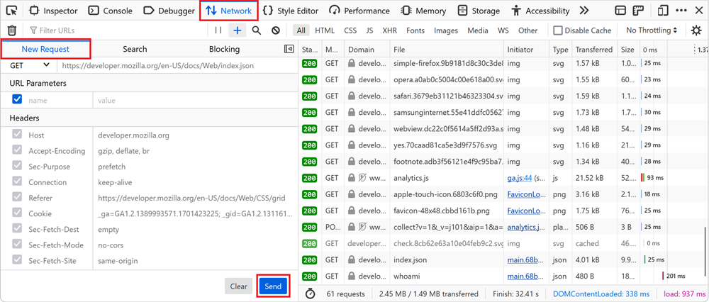

When you're investigating a bug where the backend you connect to doesn't respond with the right things it's useful to tweak the requests and try again quickly. You can do this by changing your frontend code, and reloading the page, but DevTools can help you be faster by editing and resending those requests without making any frontend code changes. Here's how!

### Using cURL

You can copy any request from the **Network** panel as a cURL command, then paste it in your terminal, edit it to your liking, and execute it!

This works in Firefox, Edge, and Chrome.

* Find the request you want to test in the **Network** panel.
* Right-click it and select **Copy** > **Copy as cURL**.

A similar approach is to use the **Copy as Fetch** option, and then use the copied code from the **Console** panel.

### Using Firefox's Edit and Resend feature

Firefox has a built-in **Edit and Resend** feature that's very convenient because it doesn't require to switch to the terminal.

* Find the request you want to test in the **Network** panel.
* Right-click it and select **Edit and Resend**.
* In the new panel that appears, you can edit the request's method, url, query string, headers, and body.
* Press **Send** when you're happy with the values.

### Using Edge's Network Console experiment

Edge has a built-in feature very similar to Firefox's **Edit and Resend**, but that goes further in that it allows you to create any number of requests to test over time, like [Postman](https://www.postman.com/).

The feature is called **Network Console** and is an experiment for the time being, so use with caution.

* Go to the **Settings** (<kbd>F1</kbd>), then **Experiments**, and check the **Enable Network Console** option (make sure to restart DevTools after that).
* You can then access the **Network Console** like any other panel, but the easiest way to get started is by going to the **Network** panel and finding the request you want to test.
* Right-click it and select **Edit and Resend**.
* In the new panel that appears, you can edit the method, url, query string, headers, body, etc.
* Press **Send** when you're happy with the values.
* You can also save this request for later. You can find all saved requests in the **Network Console** panel.

