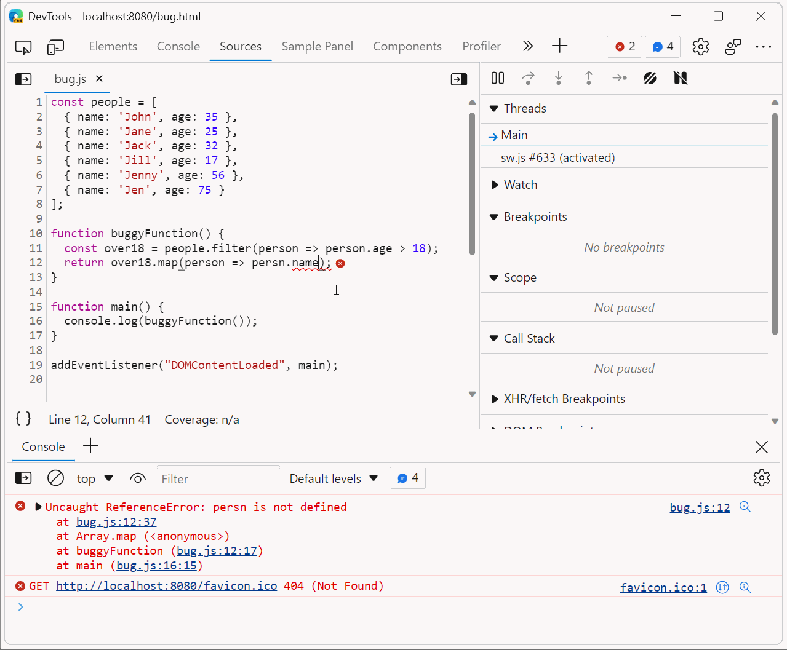

Sometimes, when debugging JavaScript code in DevTools, you may want to test a quick change and see whether that fixes the bug.

Usually, this involves the following steps:

1. Pause at a breakpoint, or an error.
1. Look at the code and local variables to understand the problem.
1. Go to your editor, make the change to the code, and save it.
1. Go back to the browser, reload the page, hit the breakpoint again (which may involve doing a bunch of other steps first).
1. Check if the fix was right.

Now in Chromium-based browsers, you can test those quick fixes much faster without ever leaving DevTools:

1. Pause at a breakpoint, or an error.
1. Look at the code and local variables to understand the problem.
1. Make your change **directly in the source shown in DevTools**, and press <kbd>Ctrl+S</kbd> (or <kbd>Cmd+S</kbd>) to save it.
1. The function is automatically restarted, with the new code, and you can verify your fix right away.

This means you don't need to leave DevTools, make your change to the original code, reload the page, and wait to hit the breakpoint or error again!

