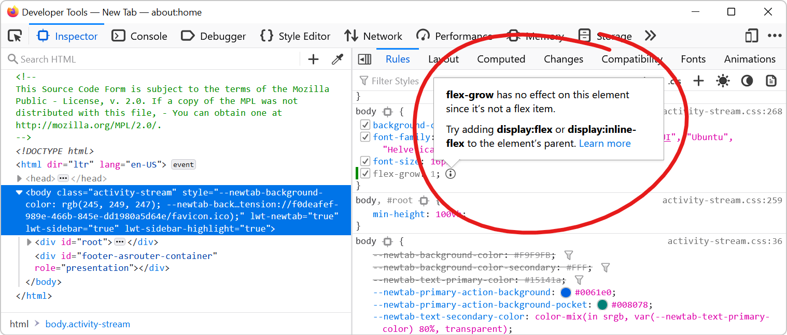
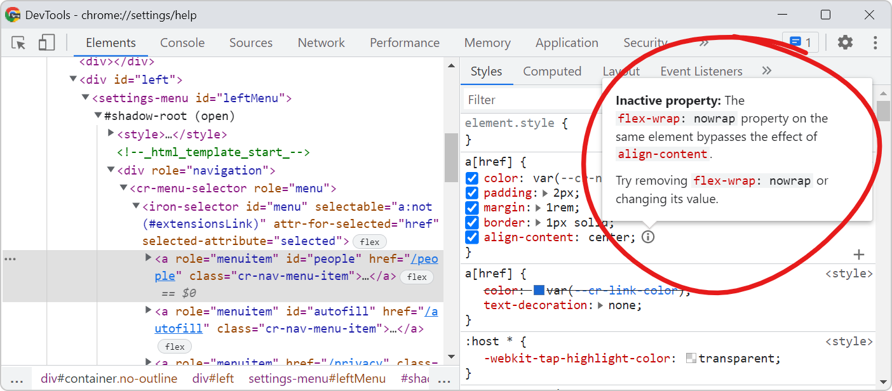

Sometimes we write CSS code that's entirely valid but has absolutely no effect at all, and this can be frustrating.

Indeed, there are many cases where a CSS declaration has no effect on an element. One common example is using `width` on an inline element. While this example may be known to most, there are so many different CSS properties and possible ways to combine them that it's impossible to know all of the cases where CSS won't have any effect.

Firefox innovated with very cool feature that helps find these "inactive" CSS properties, and Chromium-based browsers now also have something!

**In Firefox**:

* Select an element in the **Inspector** panel.
* Look at its applied styles in the **Rules** panel.
* Inactive properties are greyed out and have an information icon next to them.
* Hover over the information icon to know why the property is inactive.

**In Chrome or Edge**:

* Make sure the feature is enabled:
  * Use Chrome or Edge 106 or later.
  * In DevTools go to the Settings (press <kbd>F1</kbd>).
  * Select the **Experiments** tab, enable the **Enable CSS Authoring hints for inactive rules, deprecated properties, etc.** checkbox, close the Settings, and reload DevTools when prompted.
* Select an element in the **Elements** tool.
* Look at its applied styles in the **Styles** panel.
* Inactive properties have an information icon next to them. If you see one, that means an authoring hint is available for this property.
* Hover over the icon to reveal the tooltip with information about the property.

**Note**: this is not an audit tool! It won't help you remove useless CSS rules throughout your codebase. Its value is when inspecting specific elements only, to easily detect when a given CSS property isn't doing anything on it.
