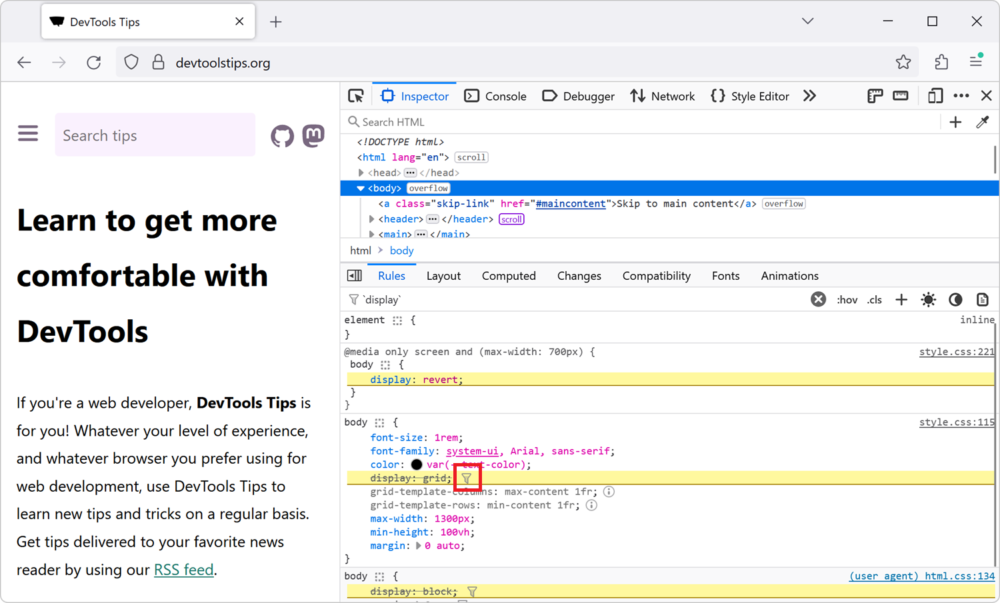

In CSS, the **cascade** plays a very important role in which CSS properties apply to an element. This key concept is not explained here, but you can learn more on MDN, at [Cascade, specificity, and inheritance](https://developer.mozilla.org/docs/Learn/CSS/Building_blocks/Cascade_and_inheritance).

When debugging CSS, sometimes you realize that the CSS property you meant to apply to an element is actually overridden by another property. Finding the overriding property is not always easy, especially when the element is styled with many CSS rules that define many properties.

Here are ways to find the overriding CSS property.

### By using the computed styles

1. Open the **Computed** styles panel in your browser DevTools. In Firefox, it's located in the **Inspector** tool. In other browsers, it's in the **Elements** tool.
1. Find the property which is overridden.
1. Expand the property by clicking the triangle icon next to it.

   The list of CSS rules that define this property appears, ordered by their specificity. The rule that wins is at the top of the list.

1. To navigate to the overriding property, click the link next to the winning rule.

### By filtering the applied rules

Firefox DevTools has a helpful feature that allows you to filter the applied CSS rules that are displayed in the **Rules** panel. This can help you find the overriding property:

1. Locate the CSS property that is overridden in the **Rules** panel of the **Inspector** tool.
1. Click the **Filter rules containing this property** icon (a funnel) next to the property name.

   The list of CSS rules is filtered to show only the rules that contain the overridden property. In addition, the property is highlighted everywhere it appears in the panel.

1. Scroll through the list of properties to find the overriding property (i.e. the one that's not struck through).

You can achieve the same result in other browsers by using the **Filter** text box that's at the top of the **Styles** panel in the **Elements** tool.

