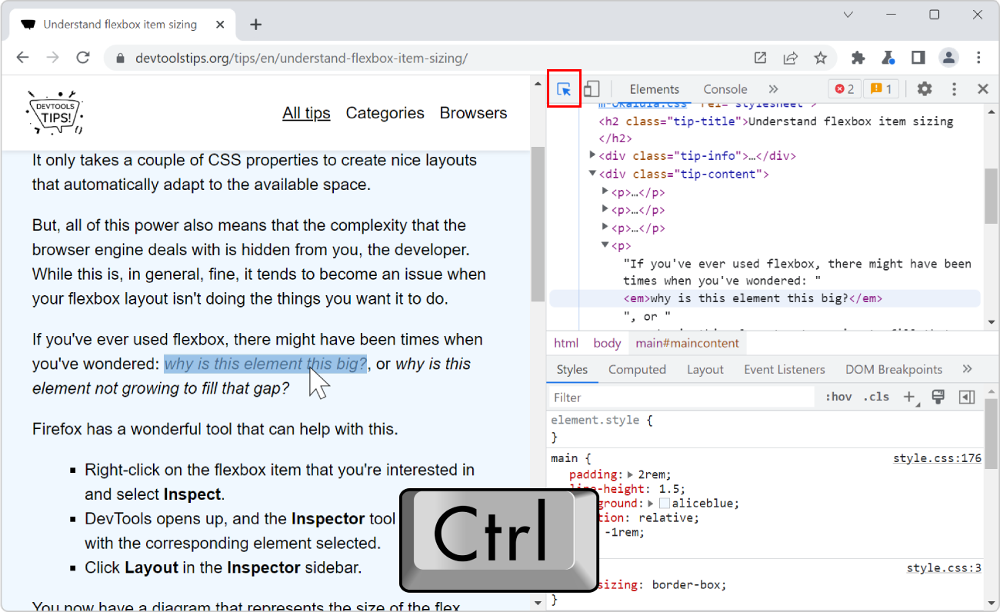

When selecting elements from the page using the **inspect** tool, the hovered elements get highlighted, and an information tooltip follows your mouse around and gives you information about the hovered element.

You can hide, or pin this information tooltip in Chrome or Edge.

## To hide the information tooltip

1. Start the **inspect** tool by clicking **Select an element in the page to inspect it** (the little cursor icon in the top left corner of DevTools).
1. Start hovering over elements in the webpage, elements get highlighted and the information tooltip appears.
1. Hold the <kbd>Ctrl</kbd> key on your keyboard, the information tooltip disappears.

## To pin the highlight and information tooltip on the current element

1. Start the **inspect** tool by clicking **Select an element in the page to inspect it** (the little cursor icon in the top left corner of DevTools).
1. Start hovering over elements in the webpage, elements get highlighted and the information tooltip appears.
1. Hold the <kbd>Ctrl</kbd> and <kbd>Alt</kbd> keys on your keyboard, the highlight and information tooltip are pinned on the current element, and you can move your mouse around without losing this information.

