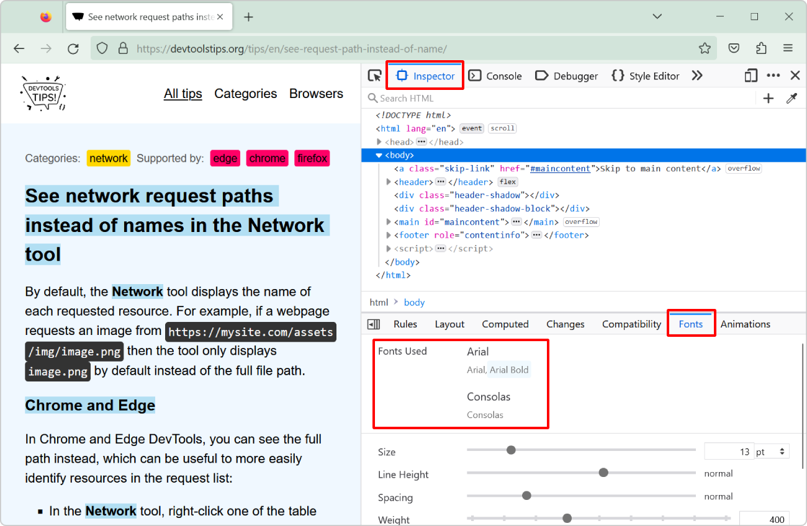
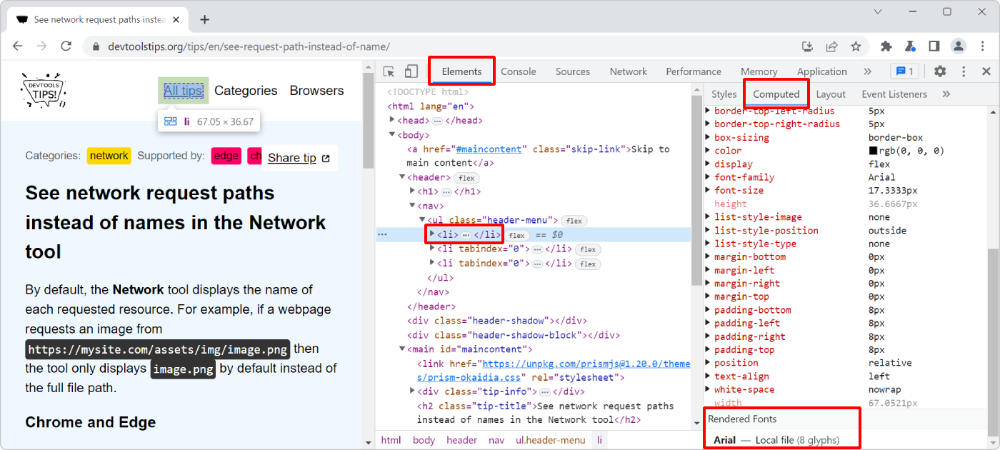

_"What font is that?"_ or _"Why is this font used?"_ are probably questions you've asked yourself while working on a website design.

However, it's not always easy to know which fonts are actually used on a webpage and looking at the CSS the page uses might not always give you the answer.

Webpages often define multiple different fonts, for example: `font-family: Baskerville, "Baskerville Old Face", "Hoefler Text", Garamond, "Times New Roman", serif;`

When the browser renders a page, if the first font in the list is not available on the device, the browser falls back to the next font. If the next one isn't available either, it falls back to the next one and so on. Also some fonts are defined with generic names such as `serif`, or `monospace`, which tells you nothing about which exact font the browser chose to use.

DevTools can help you determine which fonts are used on a webpage, or on a specific element on a page.

### In Firefox

Firefox has the best tool to inspect fonts. To know which fonts are used on a webpage:

1. Open DevTools, and open the **Inspector** tool.

1. Select the `<body>` element.

1. In the sidebar, select the **Fonts** tab.

    The list of fonts used on the page is displayed.

1. You can even hover over a font name to see where it's used on the page.

To know which fonts are used on a single element:

1. Select the element in the **Inspector** tool.
1. The **Fonts** tab updates and gives the list of fonts used in that single element.

Note that an element may require multiple fonts to render correctly, even if this element only contains a single text node. This can happen when the font used to render the element doesn't have all the glyphs required to render the text, in which case the browser falls back to another font to render the missing glyphs.

### In Chrome or Edge

In Chrome or Edge (or other Chromium-based browsers), you can see which font(s) was/were used to render a given text-containing element:

1. Open DevTools and open the **Elements tool**.

1. Select an element that has at least one text node. Elements that only contain other elements, and not directly text won't work.

1. In the sidebar, select the **Computed** tab, and scroll down the very bottom of the panel.

    The list of fonts that were used to render the text in the element appears.

### In Polypane

In Polypane, you can see which font was used to render a given text-containing element:

1. Hold `Alt`/`Option` and hover over the text you want to find the font for.

1. The rendered font is shown in the tooltip.

1. On inspection, the font is also shown in the **Element Overview**

