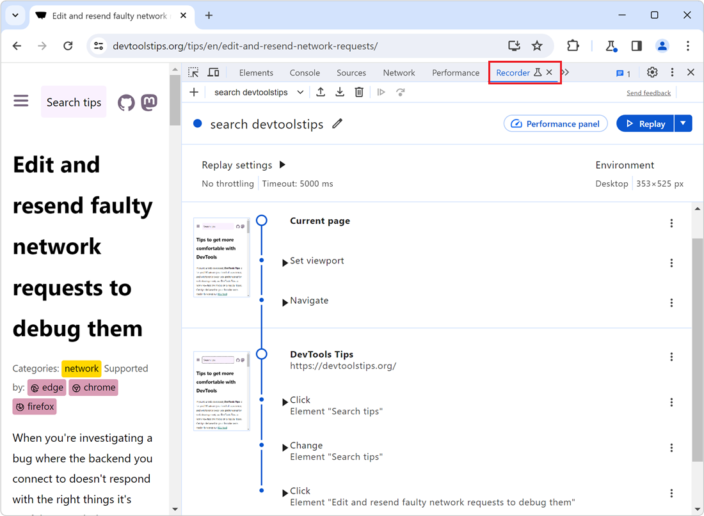

Sometimes, you need to repeatedly test the same user scenario on a website. This can happen when working on a fix or a performance improvement. Testing the same user scenario over and over again requires clicking the same buttons and do the same actions every time you reload the page. This can quickly become time consuming and frustrating.

To automate this process, you can use the **Recorder** tool in Chrome or Edge. The **Recorder** tool allows you to record any user flow once, and then replay the flow as many times as you want.

To record a new flow:

* Open the **Recorder** tool:

  * In Chrome, the **Recorder** tab is already available in the main toolbar. If you don't see it, click **More tabs** (`>>`) > **Recorder**.
  * In Edge, click **More tools** (`+`) in the Activity Bar, then **Recorder**.

* Click **Create a new recording**.

* Enter a name for your recording.

* Click **Start recording**.

* Use the page as normal, for example click on buttons, use form controls, navigate to other pages.

* When you're done with the user flow you want to record, click **End recording**.

Your recording is now available in the **Recorder** tool. To replay your recording, click **Replay**.

If you close and then reopen DevTools, your recording will still be available in the **Recorder** tool. To replay it:

* Find your recording in the tool's initial screen, or from the dropdown located in the tool's toolbar.
* Click **Replay**.

To learn more about the **Recorder** tool (including how to edit a recording and how to use it to test performance improvements), see [Record, replay, and measure user flows](https://developer.chrome.com/docs/devtools/recorder/).
