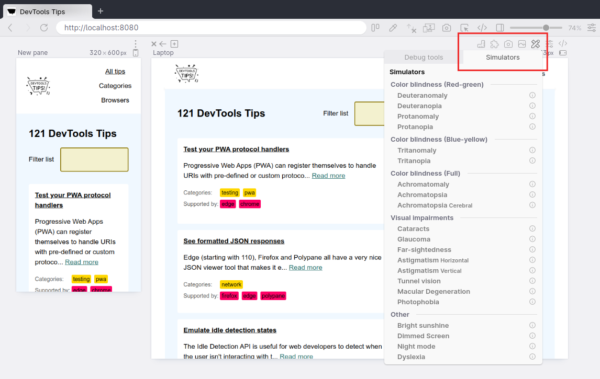

People who visit your web pages may have different types of color vision deficiencies that, if you incorrectly use colors for meaning, may affect their experience.

Firefox, Chrome, Polypane and Edge make it possible for you to test how a web page may appear to somebody with a color vision deficiency.

## Firefox

* Open the **Accessibility** tool.
* In the toolbar at the top, choose from a selection of different color vision deficiencies in the **Simulate** drop-down.

## Chrome and Edge

* Open the **Rendering** tool by either using the [command menu](./execute-commands.md) and type "rendering", or by using the main menu (the **...** icon in the top-right corner of the screen) and by going to **More Tools**.
* Scroll down until you find the **Emulate vision deficiencies** section, and choose from the drop-down.

## Polypane

* Open the **Debug tools** option of a pane.
* Switch to **Simulators**.
* Select one of the nine available color vision simulators or hover over the **i** icon for additional information.

